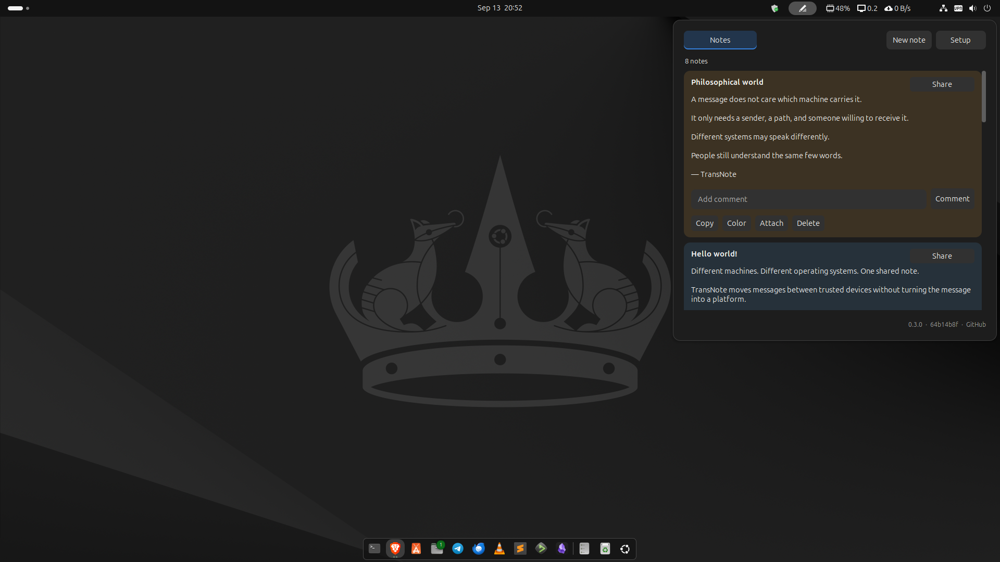

# TransNote for Ubuntu

TransNote is a GNOME Shell extension for small shared notes between trusted workstations.

This repository is the Ubuntu GNOME port of the original [TransNote](https://github.com/ariDev1/transNote) plugin for Omarchy Linux.

The Ubuntu port keeps the existing TransNote note model and compatible folder-sync architecture. The original Omarchy project remains unchanged.



## Current release

- TransNote 0.6.0
- GNOME Shell 46 and 50
- Extension UUID: `transnote@aridev1`
- Extension version: `7`
- Footer build information: `0.6.0 · <revision> · GitHub`
- Ubuntu ↔ Ubuntu device sync supported
- Ubuntu ↔ Omarchy folder sync supported

## Features

- Create local notes
- Copy and delete notes
- Share and unshare notes
- Comments
- Attachments
- Note background colors
- Compact expandable note cards
- Contextual note search by title, body, and author
- Red unread indicator for new peer notes and comments
- Automatic peer polling
- Compatible folder synchronization
- Deletion and unshare tombstones prevent stale shared notes from reappearing
- Built-in Syncthing-assisted device pairing
- Setup-code pairing between computers
- Automatic trusted-peer updates after pairing
- Acceptance of pending computer connections
- Acceptance of pending TransNote folders
- Symmetric setup-code pairing: either computer can initiate pairing
- Established TransNote shares remain authoritative during onboarding
- Automatic first-run machine name
- Automatic default sync folder on first run
- Advanced controls for machine name, shared folder, trusted peers, and diagnostics

Opening TransNote clears the unread indicator. Existing notes do not create a false unread state after extension startup.

## Requirements

- Ubuntu with GNOME Shell 46 or 50
- Node.js
- Git
- Syncthing for the built-in device-sync setup, or another tool that synchronizes the shared folder

Install the required packages:

```bash
sudo apt update
sudo apt install git nodejs syncthing
systemctl --user enable --now syncthing.service
```

## Installation

```bash
mkdir -p ~/.local/share/gnome-shell/extensions

git clone \
  https://github.com/ariDev1/transNote-ubuntu.git \
  ~/.local/share/gnome-shell/extensions/transnote@aridev1

git -C ~/.local/share/gnome-shell/extensions/transnote@aridev1 \
  rev-parse --short=8 HEAD \
  > ~/.local/share/gnome-shell/extensions/transnote@aridev1/.transnote-revision

gnome-extensions enable transnote@aridev1
```

The local `.transnote-revision` file supplies the short Git revision shown in the footer. It is not committed to the repository.

If GNOME does not detect the extension immediately, log out and log in again.

## Updating

```bash
EXTENSION_DIR="$HOME/.local/share/gnome-shell/extensions/transnote@aridev1"

git -C "$EXTENSION_DIR" pull --ff-only

git -C "$EXTENSION_DIR" rev-parse --short=8 HEAD \
  > "$EXTENSION_DIR/.transnote-revision"
```

After an update, log out and log in again if GNOME Shell does not reload the extension.

## Device sync setup

Open **TransNote → Setup**.

On a new installation, TransNote creates a machine name and the default sync folder automatically. The generated machine name remains stored as the local TransNote identity.

For normal setup:

1. Select **Start new sync** on either computer.
2. Copy **Your setup code**.
3. Open TransNote on the other computer.
4. Paste the code under **Join existing sync**.
5. Select **Connect**.
6. If the code came from a new computer and the receiving computer already has an established TransNote share, return to the new computer and accept the **Pending computer connection**.
7. Accept the **Pending TransNote folder** if it appears.

The established TransNote share remains authoritative. A fresh provisional TransNote folder can be replaced when the computer joins that established share.

Pairing updates the trusted-peer list on the computer that imports the setup code.

Normal setup does not require manual Syncthing device IDs, folder IDs, the Syncthing web interface, or terminal commands.

The **Advanced** section keeps the technical controls available when they are required:

- Machine name
- Shared folder
- Trusted peers
- Folder creation
- Manual save and status check
- LAN and Syncthing diagnostics

Keep the machine name stable after you start to share notes.

If the shared folder is already synchronized by another supported method, TransNote can continue to use that folder without creating a second sync protocol.

Only notes marked as shared are written to the shared snapshot.

## Data

Local TransNote data is stored in:

```text
~/.local/share/transnote/
```

The main local note file is:

```text
~/.local/share/transnote/notes.json
```

A backup is kept as:

```text
~/.local/share/transnote/notes.json.bak
```

Shared notes are stored as JSON snapshots in the configured synchronization folder.

## Compatibility

The Ubuntu port does not create a second TransNote folder-sync protocol.

It preserves the compatible note and snapshot architecture so that Ubuntu and Omarchy systems can exchange shared notes.

The Ubuntu port supports snapshot version 2 deletion tombstones and continues to accept version 1 snapshots.

Original Omarchy project:

https://github.com/ariDev1/transNote

Ubuntu project:

https://github.com/ariDev1/transNote-ubuntu

## Agent interface

TransNote includes an optional restricted local Agent CLI:

```text
~/.local/bin/transnote-agent
```

Install it explicitly from the repository:

```bash
./tools/install-agent-cli.sh
```

The Agent protocol exposes only:

```text
status
capabilities
list
get
search
create
comment
share
```

Agent-created notes are private by default. `share` is allowed only for a
visible local note that was created through the restricted Agent interface.
Delete, unshare, hide, pairing, sync administration, attachment mutation,
arbitrary filesystem access, command forwarding, and identity override are
not exposed.

Agent provenance is local-only. It is not written into shared TransNote
snapshots.

Remove the CLI with:

```bash
./tools/uninstall-agent-cli.sh
```

### OpenCode adapter

TransNote includes an optional restricted OpenCode adapter under:

```text
tools/opencode/
```

The adapter exposes only these dedicated custom tools:

```text
transnote_status
transnote_list
transnote_search
transnote_create
transnote_comment
transnote_share
```

The OpenCode profile denies all other capabilities by default. General shell
access, filesystem tools, Git, web access, and subagents remain denied.

Install the adapter explicitly:

```bash
./tools/opencode/install.sh
```

The adapter supports the OpenCode V1 permission model. An unknown major
version fails closed. A new or changed OpenCode version is not trusted until
the permission-boundary acceptance test passes.

Run the non-mutating test in `tools/opencode/security-test.txt` with the
restricted `Transnote` agent. Verify that the OpenCode footer still shows
`Transnote` before the test. If it shows another agent such as `Build`, stop
the test and select `Transnote`.

After the permission-boundary test passes, run the separate explicit-share
test in `tools/opencode/share-test.txt`. It uses two user messages: the first
creates a private Agent note, and the second explicitly requests sharing.

After both field tests pass, record the exact tested OpenCode version:

```bash
./tools/opencode/mark-tested.sh --accept-security-test
```

Then start the restricted agent through:

```bash
./tools/opencode/run.sh
```

Remove the adapter with:

```bash
./tools/opencode/uninstall.sh
```

## Development

- `main` is the verified release baseline.
- `development` is used for new work before promotion.

Run the test suite with:

```bash
python3 -m unittest discover -s tests -v
```

Project changes should remain deterministic, minimal, measurable, reversible, and supported by evidence.
